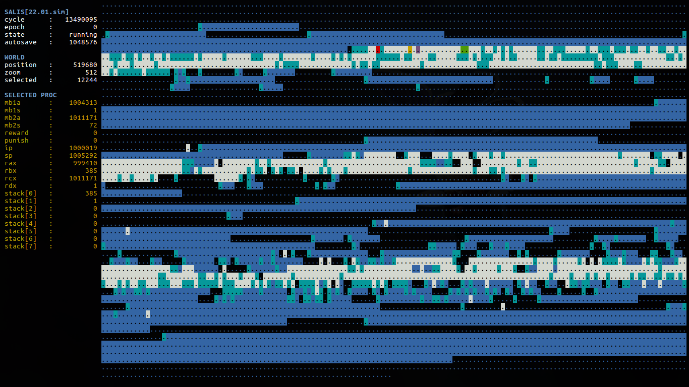

# SALIS: Artificial Life Simulator (v2.0)



### Overview
SALIS is my newest artificial life project. Mainly a re-take on Tom Ray's
TIERRA simulation, but with my very own set of tweaks. Having a grasp on TIERRA
will make understanding this simulation a lot easier.

- [video about TIERRA](https://www.youtube.com/watch?v=Wl5rRGVD0QI)
- [read about TIERRA](http://life.ou.edu/pubs/doc/index.html#What)

For those that already know TIERRA, the main difference between it and SALIS is
the addition of a seeker pointer to all organisms.

The seeker pointer (SP) is an attempt to bring extra spatial and temporal
coherence to the simulation. Allocation, reads and writes will take more time
when done between addresses that are far away, as a consequence of the SP
having to travel those distances at a constant speed.

To watch an introductory video about SALIS (v1.0)
[go here.](https://www.youtube.com/watch?v=jCFmOCvy6po)

Follow SALIS on
[Reddit.](https://www.reddit.com/r/salis/)

### CPU structure
In SALIS, CPUs are considered the actual, living organisms. They all consist of
the following elements:
- One or two associated memory blocks
- One instruction pointer
- One seeker pointer
- One reward pointer
- One punishment pointer
- 4 general-purpose registers
- A stack of 8 values

### Queue
- Newborn organisms are placed on top of the queue
- Organisms are killed at the bottom of the queue
- Organisms are killed whenever memory fills above 50%

### Evolution
In SALIS mutation occurs via *cosmic rays*: at every cycle a random 32 bit
address is selected and a random instruction is written into it. This simple
mutation scheme is enough to allow evolution by natural selection to occur.

### Instruction set
SALIS' organisms read a simple language similar to ASM. This language
consists of 32 instructions, each with an associated name and symbol. Whenever
an organism performs an invalid instruction it is considered a *fault*.
When a *fault* is committed by any organism it gets punished, and stops its
execution during a full simulation cycle.

### Faults may be caused by:
- Not having enough register modifiers located after the current instruction
- Performing a search or attempting a jump without a following template
- Writing to an allocated (but not owned) or invalid address
- Reading (loading) from an invalid address
- SP being on address non-adjacent to child memory block, while allocating
- Swapping or splitting when not owning 2 memory blocks
- Dividing by zero
- Attempting to eat from an allocated (but not owned) or invalid address

### Entropy
SALIS-2.0 introduces the EAT instruction and the concept of entropy.
Organisms may now 'consume' information (in the form of instructions) and trade
them for extra execution speed. When eaten, information gets destroyed
(randomized).

### The Common Pipe
The common pipe is a mechanism through which different SALIS simulations can
communicate. This is done via a FIFO file object that gets instantiated
whenever a Salis simulation is running. Organisms can push or pull instructions
to/from this common pipe via the SEND/RCVE instructions.

### Instruction set
|Name |Symbol |Arguments |Description |
|:------|:---|:----|-:|
|`NOP0` |`.` |0 |Template constructor |
|`NOP1` |`:` |0 |Template constructor |
|`MODA` |`a` |0 |Register modifier |
|`MODB` |`b` |0 |Register modifier |
|`MODC` |`c` |0 |Register modifier |
|`MODD` |`d` |0 |Register modifier |
|`JMPB` |`(` |0 |Jump back to template complement |
|`JMPF` |`)` |0 |Jump forward to template complement |
|`ADRB` |`[` |1 |Search back for template complement |
|`ADRF` |`]` |1 |Search forward for template complement |
|`MALB` |`{` |2 |Allocate backward |
|`MALF` |`}` |2 |Allocate forward |
|`SWAP` |`%` |0 |Swap memory blocks |
|`SPLT` |`$` |0 |Split child memory block |
|`INCN` |`^` |1 |Increment register |
|`DECN` |`v` |1 |Decrement register |
|`ZERO` |`0` |1 |Zero out register |
|`UNIT` |`1` |1 |Place 1 on register |
|`NOTN` |`!` |1 |Negation operator |
|`IFNZ` |`?` |1 |Conditional operator |
|`SUMN` |`+` |3 |Add two registers |
|`SUBN` |`-` |3 |Subtract two registers |
|`MULN` |`*` |3 |Multiply two registers |
|`DIVN` |`/` |3 |Divide two registers |
|`LOAD` |`L` |2 |Load instruction from memory |
|`WRTE` |`W` |2 |Write instruction into memory |
|`SEND` |`S` |1 |Send instruction to common pipe |
|`RECV` |`R` |1 |Receive instruction from common pipe |
|`PSHN` |`#` |1 |Push value to stack |
|`POPN` |`~` |1 |Pop value from stack |
|`EATB` |`<` |0 |Eat backwards |
|`EATF` |`>` |0 |Eat forward |

Instructions with arguments *must* be followed by a minimum number of register
modifiers equal to the instruction's parameters. Otherwise the instruction will
cause a fault.

### Installing SALIS
You'll need a C compiler (GCC) and python 3. A sample makefile is provided
for GNU Make. Just run `make` inside this directory. Also, make sure to make
the Salis.py script executable as such:
```bash
$ git clone https://github.com/paultoliver/salis-2.0
$ cd salis-2.0/
$ make
$ chmod +x bin/salis.py
```

You may edit the makefile as needed. Library should compile easily on Linux
with the GCC compiler. Feel free to open up an issue if any problems arise that
are specific to your distribution, or if you'd like to port Salis to other
platforms. :-)

### Running SALIS
Assuming you have python 3 already installed and in your PATH, as well as the
Cython package installed, you may run SALIS in one of the following ways. Top
one creates a new simulation of order 16 and gives it the name
`./bin/sims/16.sim`. The second one attempts to load an existing save-file from
the `./bin/sims` directory.
```bash
$ ./bin/salis.py new --order 16 --file 16.sim
$ ./bin/salis.py load --file 16.sim
```

Look at README file inside the `./bin` directory for a full list of commands.

### New features on Salis-2.0
- Tierran templates are now used instead of keys/lock pairs
- The instruction set is shorter
- Organisms can send/receive instructions to/from a common pipe
- Organisms can "eat" information
- Organisms are rewarded for eating
- Organisms are punished on faults

### Python integration
- Salis controller/viewer is now written in python 3
- Salis C header files are parsed for easier DLL loading
- Organisms' IP addresses are now shown on WORLD view
- Salis console allows line editing and command history
- Genome compilation is now done via the python Handler module
